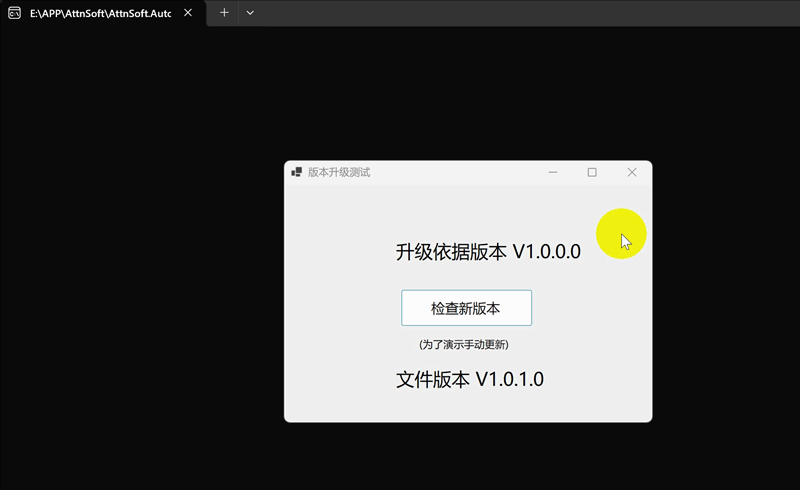

# AttnSoft.AutoUpdate


AttnSoft.AutoUpdate 是一款轻量级、易于使用、跨平台的应用程序自动升级组件。

## 快速开始

#### 客户端使用
##### Windows环境
在您的主项目中安装AttnSoft.AutoUpdate NuGet包,根据需要按照如下示例代码配置即可

示例代码：

1) 系统默认为OSS方式获取版本信息:
```csharp
UpdateContext? context = new UpdateContext()
{
    UpdateUrl = "http://update.attnsoft.com/demo/v1/version.json"
};
await UpdateApp.CreateBuilder(context).StartUpdateAsync();
```
2) 启用WebApi方式获取版本信息:
```csharp
UpdateContext? context = new UpdateContext()
{
    UpdateUrl = "http://127.0.0.1:5000/Verification"
};
context.UseWebApi();
await UpdateApp.CreateBuilder(context).StartUpdateAsync();
```
升级组件内部会向UpdateUrl发送Post请求,获得版本信息.

3) 自定义方式获取版本信息:
```csharp
UpdateContext? context = new UpdateContext()
{
    UpdateUrl = "http://127.0.0.1:5000/Verification"
};
context.UseWebApi();
context.OnGetUpdateVersionInfo += (context) =>
{
    var uri = new Uri(context.UpdateUrl);
    using var httpClient = new HttpClient();
    httpClient.DefaultRequestHeaders.Authorization =
        new System.Net.Http.Headers.AuthenticationHeaderValue("Authorization", "tokenxxx");
    string postData = $"{{\"Version\": \"{context.ClientVersion}\", \"AppKey\": \"{context.AppSecretKey}\"}}";
    var stringContent = new StringContent(postData, Encoding.UTF8, "application/json");
    var result = await httpClient.PostAsync(uri, stringContent);
    var responseJsonStr = await result.Content.ReadAsStringAsync();
    return JsonSerializer.Deserialize<List<VersionInfo>>(responseJsonStr);
};
await UpdateApp.CreateBuilder(context).StartUpdateAsync();
```

##### Linux环境
请使用源码编译方式:
```
git clone https://github.com/liaiwu/AttnSoft.AutoUpdate.git
```

1. 编译AttnSoft.AutoUpdate并在主项目中引用
2. 编译AttnSoft.Upgrade项目。
根据具体使用环境选择相应的linux平台,并将生成的Upgrade可执行文件与主程序放到同一个目录下。
3. 代码使用与上述Windows环境一致


#### 服务端配置
本组件支持两种存储版本信息的方式:
1. OSS:在文件服务器(对象存储服务)上配置Version.json文件,用来描述发布的版本信息.
2. WebApi:组件通过Web服务的方式获取版本信息.

以上两种方式提供的版本信息都是json格式的，具体内容如下:
```json
[
    {
        "recordId": 1,
        "version": "1.0.0.0",
        "requiredMinVersion": "",
        "url": "http://update.attnsoft.com/demo/v1/WinAppClient.zip",
        "hash": "SHA256",
        "startAppCmd": "WinAppClient",
        "isForcibly": false,
        "desc": "Introduction to the new version features.",
        "releaseDate": "2025-01-15T09:23:19",
        "updateLogUrl": null,
        "blackFileFormats": [ ".patch", ".zip", ".rar", ".tar", ".pdb" ],
        "blackFiles": [],
        "skipDirectorys": [ "app-", "fail" ]
    }
]
```
#### 补丁包制作
可以根据补丁包的大小选择如下两种方式:
1. 全量更新：
如果补丁包不大的话,可以直接将要更新的文件用压缩工具生成单一ZIP格式的文件即可。
2. 差异更新：
如果补丁包很大的话,可以采用差异更新方式制作补丁包以减少补丁包的大小。
可以使用GeneralUpdate提供的[工具包](https://github.com/GeneralLibrary/GeneralUpdate.Tools.git)制作。

### WinAppClient运行示例


此示例演示了winform下程序升级过程。


## 支持框架

| .NET框架名称               | 是否支持 |
| -------------------------- | -------- |
| .NET Framework 4.6.1       | 支持     |
| .NET Core 2.0 、3.1        | 支持     |
| .NET 5  to last version   | 支持     |

### 开源链接
Github: https://github.com/liaiwu/AttnSoft.AutoUpdate.git

Gitee:  https://gitee.com/attnsoft/AttnSoft.AutoUpdate.git

## 感谢

项目中GeneralUpdate命名空间下的代码均来源于[GeneralUpdate](https://github.com/GeneralLibrary/GeneralUpdate.git)项目。非常感谢GeneralUpdate团队的开源贡献。

